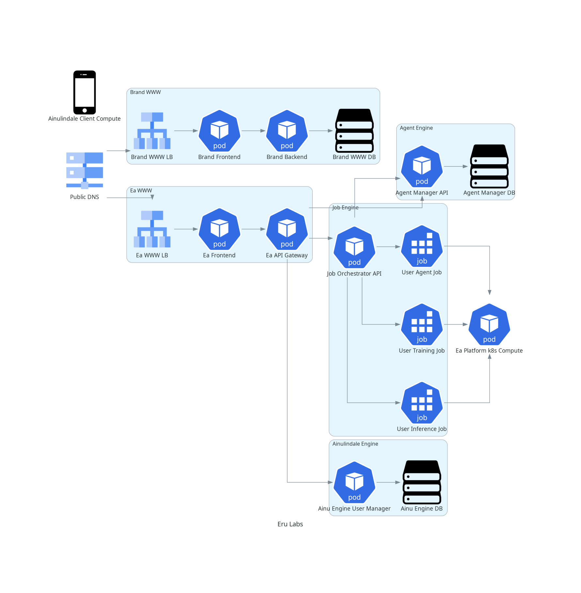
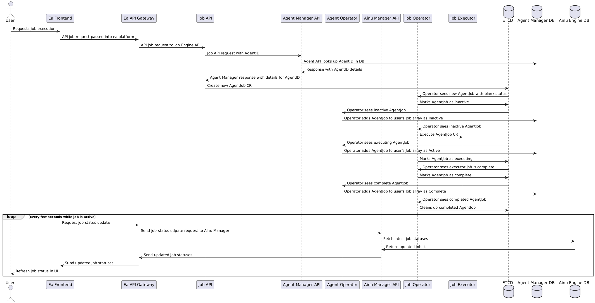

# eru-labs-monorepo
A monorepo for all things eru labs

## Table of Contents
- [Who we Are](#who-we-are)
- [Core features](#core-features)
- [Repo Contents](#repo-contents)
- [Platform Design](#platform-design)
- [Ea Platform Architecture](#ea-platform-architecture)
- [Request/Response Diagrams](#requestresponse-diagrams)
- [Quick Local Development](#quick-local-development)

## Who we are
What is Eru Labs? We are a small team of nerds working to disrupt industries by commodifying the idle compute everyone is surrounded by every day.

We make this possible with the Ea Platform. A system that allows users to donate their device's idle compute time in exchange for `compute credits` they can in turn use to run their own AI agents, infrence, and training jobs. 

## Core features
Core features of the Ea Platform are:
- The Ainulindale client software that allows users to connect their idle device compute to the Ea network in exchange for compute credits
- A Node based AI agent/workflow builder
- A job engine that allows users to run Agent Workflows, Inference jobs, and Training jobs on the Ea network
- A marketplace for users to buy and sell Agent workflows, datasets, or their earned compute credits 
- Leaderboards and gamification challenges for users to show off and earn more compute credits by completing challenges and gaining ranks
- Dataset storage for users models, datasets, outputs, ect

## Repo Contents

| Category | Components | Description |
|----------|-----------|-------------|
| **Eru Labs Brand** | [brand-frontend](brand/brand-frontend/README.md) | Frontend for the Eru Labs brand site |
|  | [brand-backend](brand/brand-backend/README.md) | Backend for the Eru Labs brand site |
| **Ea Platform Frontend** | [ea-frontend](ea-platform/ea-frontend/README.md) | UI for building and managing AI agents |
| **Ea Agent Engine** | [ea-agent-manager](ea-platform/ea-agent-manager/README.md) | Manages agent + node creation and definitions |
| **Ea Ainu Engine** | [ea-ainu-manager](ea-platform/ea-ainu-manager/README.md) | Manages user devices and agent jobs |
|  | [ea-ainu-operator](ea-platform/ea-ainu-operator/README.md) | Operator to sync agent job status to frontend |
| **Ea Job Engine** | [ea-job-api](ea-platform/ea-job-api/README.md) | API for job execution |
|  | [ea-job-operator](ea-platform/ea-job-operator/README.md) | Operator to process agent jobs |
|  | [ea-job-executor](ea-platform/ea-job-executor/README.md) | Executor for executing agent jobs |
| **Ainulindale Client Software** | [Ainulindale Clients](ainulindale-client/README.md) | Distributed compute client for AI workloads |
| **Infrastructure & Deployment** | [infra](infra/README.md) | Terraform configurations for local and cloud deployments |
| **Documentation** | [diagrams](docs/diagrams/README.md) | Diagrams managed as code |


## Platform Design
Each core feature of the Ea platform usually consists of one or more microservices working together to drive that feature. These are called "Ea Feature Engines". When adding a new core feature, we must implement a new Feature Engine that we can plug into the rest of the platform. Feature Engines should be designed to follow microservice design best practices around state, decoupling, and separation of concerns. 

Our platform will be built in multiple phases. These phases are tracked as Github issue milestones in this repo

### Phase 1: Agent Engine and MVP development
- ea-frontend node based agent builder
- ea-job-engine to execute agents
- ea-ainu-engine to manage user devices and agent jobs for the front end
- ea-agent-engine to manage creation of node and agent definitions
- The framework for the rest of the Ea platform engines to come

### Phase 2: Commerce Engine and Gamification
- ea-frontend marketplace
- ea-frontend leaderboards, ranks, challenges
- ea-commerce-engine for driving the marketplace
- ea-game-engine for driving gamification

### Phase 3: Distributed Job Engine
- ainulindale client software for linux, mac, windows, mobile, ect

The actual novel tech and selling point of the Ea platform.

Distribute jobs to client devices running the Ainulindale client for running inference/compute/agent jobs. Should support mobile devices, user computers, tablets, ect. anything with a CPU, GPU, or TPU should be able to run Ainulindale. Users gain compute credits in exchange for their idle compute time. They can then spend these compute credits to run their own jobs, or sell the accumulated compute credits on the marketplace via the commerce engine

### Phase 4: P2P and decentralization
Build new model parallelism protocols on top of existing p2p protocols like bittorrent to allow p2p updating of model weights rather than relying on a central sharing platform.

Implement meshnet protocols like BATMAN on the Ainulindale clients to allow localized p2p communications?

### Phase 5: Cloud deployment and Production readiness
Do the SRE needful to scale this thing to millions of users


## Ea Platform Architecture


## Request/Response diagrams
### Job Workflow



## Quick local development for one service
If you want to develop something locally for one service without standing up the whole platform you can start up a mongodb server with:
```bash
docker-compose up
```
and then start your service from its app folder with:
```bash
go run main.go
```

## Run everything locally with minikube
Some services (ea-job-engine) require kubernetes specifically for their operator patterns. Therefore we need a local kubernetes cluster for development. Minikube is the best bet. 

I have created a helper script to easily set up the entire platform in a local cluster.

### Requirements
- minikube
- terraform 1.10.3
- tfenv (optional, for managing terraform versions)
- helm
- kubectl
- docker

### Start up Eru Labs components locally with helm and minikube
```bash
minikube delete # Clean up previous minikube setups
minikube start --driver=docker --extra-config=kubelet.max-pods=1000 #set a large single node cluster for ease of use, allow lots of pods
minikube addons enable registry

./minikube.sh start # builds and runs all apps in local minikube, sets up portforwarding for local development, seeds test data, runs smoke tests

./minikube.sh stop # delete all services from the cluster and cleans up portforwarding processes
```
### Adding new services
To add a new service to the startup script simple create a new directory `<ea-platform|brand>/app`. Add a Dockerfile and `chart` directory that contains the standard helm chart. Then update the local terraform environment in `infra/environments/local/main.tf` in the `locals` section

Optionally, you can add a portforward line in the minikube.sh script's `k8s_port_forward()` function using existing as the example. 

#### Service naming conventions
For simplicity and ease of expansion going forward, all new services should fall under the naming convention:
```
<ea|brand>-<engine>-<newservice>
```

- All Ea platform services should be prefixed with `ea`, brand webpage services should be prefixed with `brand`
- All services should belong to an existing feature engine or a new feature engine with a unique name. 
- `<newservice>` should be short and descriptive ie. api, operator, executor, etc. 


#### Smoke tests
All new API services should have associates `tests/smoke` directories and simple smoke tests to either populate test data or verify API handler functionality. 

