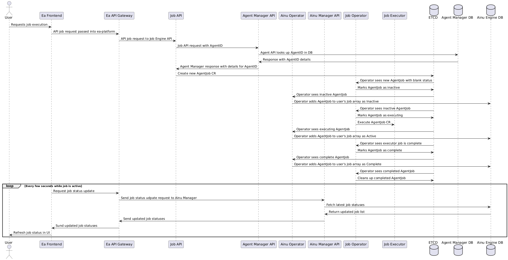

# ea-monorepo
A monorepo for all things the ea platform

## Table of Contents
- [Core features](#core-features)
- [Repo Contents](#repo-contents)
- [Platform Design](#platform-design)
- [Ea Platform Architecture](#ea-platform-architecture)
- [Request/Response Diagrams](#requestresponse-diagrams)
- [Quick Local Development](#quick-local-development)

## Core features
Core features of the Ea Platform are:
- A Node based AI agent/workflow builder to allow users to build complex AI workflows integrated with their own APIs or 3rd parties.
- Low code json Schemas for defining Nodes and Agents.
- A job engine that allows users to run Agent Workflows, Inference jobs, and Training jobs on the Ea network
- Dataset storage for users models, datasets, outputs, ect

## UI Screenshots


## Repo Contents

| Category | Components | Description |
|----------|-----------|-------------|
| **Eru Labs Brand** | [brand-frontend](brand/brand-frontend/README.md) | Frontend for the Eru Labs brand site |
|  | [brand-backend](brand/brand-backend/README.md) | Backend for the Eru Labs brand site |
| **Ea Platform Frontend** | [ea-front](ea-platform/ea-front/README.md) | UI for building and managing AI agents |
| **Ea Agent Engine** | [ea-agent-manager](ea-platform/ea-agent-manager/README.md) | Manages agent + node creation and definitions |
| **Ea Ainu Engine** | [ea-ainu-manager](ea-platform/ea-ainu-manager/README.md) | Manages user devices and agent jobs |
|  | [ea-ainu-operator](ea-platform/ea-ainu-operator/README.md) | Operator to sync agent job status to frontend |
|  | [ea-credentials-manager](ea-platform/ea-credentials-manager/README.md) | Securely stores 3rd party credentials |
| **Ea Job Engine** | [ea-job-api](ea-platform/ea-job-api/README.md) | API for job execution |
|  | [ea-job-operator](ea-platform/ea-job-operator/README.md) | Operator to process agent jobs |
|  | [ea-job-executor](ea-platform/ea-job-executor/README.md) | Executor for executing agent jobs |
|  | [ea-job-utils](ea-platform/ea-job-utils/README.md) | utilities API for in house node functionality |
| **Infrastructure & Deployment** | [infra](infra/README.md) | Terraform configurations for local and cloud deployments |
| **Documentation** | [diagrams](docs/diagrams/README.md) | Diagrams managed as code |


## Platform Design
Each core feature of the Ea platform usually consists of one or more microservices working together to drive that feature. These are called "Ea Feature Engines". When adding a new core feature, we must implement a new Feature Engine that we can plug into the rest of the platform. Feature Engines should be designed to follow microservice design best practices around state, decoupling, and separation of concerns. 

Our platform will be built in multiple phases. These phases are tracked as Github issue milestones in this repo

### Phase 1: Agent Engine and MVP development
- ea-frontend node based agent builder
- ea-job-engine to execute agents
- ea-ainu-engine to manage user devices and agent jobs for the front end
- ea-agent-engine to manage creation of node and agent definitions
- ea-data-engine to manage user datasets and data
- The framework for the rest of the Ea platform engines to come
- **alpha launch**

## Ea Platform Architecture


## Request/Response diagrams
### Job Workflow



## Quick local development for one service
If you want to develop something locally for one service without standing up the whole platform you can start up a mongodb server with:
```bash
docker-compose up
```
and then start your service from its app folder with:
```bash
go run main.go
```

## Run everything locally with minikube
Some services (ea-job-engine) require kubernetes specifically for their operator patterns. Therefore we need a local kubernetes cluster for development. Minikube is the best bet. 

I have created a helper script to easily set up the entire platform in a local cluster.

### Requirements
- minikube
- terraform 1.10.3
- tfenv (optional, for managing terraform versions)
- helm
- kubectl
- docker

### Start up Eru Labs components locally with helm and minikube
```bash
### Optional: use GPUs
# Install the nvidia container toolkit https://docs.nvidia.com/datacenter/cloud-native/container-toolkit/latest/install-guide.html
# Follow setup instructions for minikube https://minikube.sigs.k8s.io/docs/tutorials/nvidia/
sudo nvidia-ctk runtime configure --runtime=docker && sudo systemctl restart docker

minikube delete # Clean up previous minikube setups

# WITHOUT GPU
minikube start --driver=docker --extra-config=kubelet.max-pods=1000 --cni calico

# WITH GPU
minikube start \
  --driver=docker \
  --container-runtime docker \
  --gpus all \
  --extra-config=kubelet.max-pods=1000 \
  --cni calico

# need to increase the filesystem user watches
minikube ssh -- "sudo sysctl -w fs.inotify.max_user_watches=10000 fs.inotify.max_user_instances=1000 fs.file-max=50000 && ulimit -n 50000"

./minikube.sh start # builds and runs all apps in local minikube, sets up portforwarding for local development, seeds test data, runs smoke tests

./minikube.sh stop # delete all services from the cluster and cleans up portforwarding processes
```
The script will update your /etc/hosts file and these domains should be avialable to you

| Domain | Description | 
|----------|-----------|
| api.ea.erulabs.local | The ea-platfor api gatewway |
| ea.erulabs.local | The Ea frontend UI |
| erulabs.local | The brand-frontend Eru Labs brand webpage |
| grafana.erulabs.local | Grafana for visualizing system metric and log data |

### Adding new services
To add a new service to the startup script simple create a new directory `<ea-platform|brand>/app`. Add a Dockerfile and `chart` directory that contains the standard helm chart. Then update the local terraform environment in `infra/environments/local/main.tf` in the `locals` section

Optionally, you can add a portforward line in the minikube.sh script's `k8s_port_forward()` function using existing as the example. 

#### Service naming conventions
For simplicity and ease of expansion going forward, all new services should fall under the naming convention:
```
<ea|brand>-<engine>-<newservice>
```

- All Ea platform services should be prefixed with `ea`, brand webpage services should be prefixed with `brand`
- All services should belong to an existing feature engine or a new feature engine with a unique name. 
- `<newservice>` should be short and descriptive ie. api, operator, executor, etc. 


#### Smoke tests
All new API services should have associates `tests/smoke` directories and simple smoke tests to either populate test data or verify API handler functionality. 

