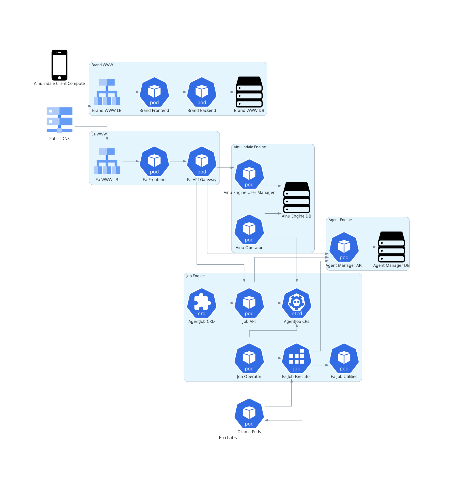

# eru-labs-monorepo
A monorepo for all things eru labs

## Contents
- Eru Labs brand webpage front/backends 
    - Built with Bootstrap for frontend
    - Built with `go 1.22.2` for backend
- Ea platform front/backends
    - Built with Bootstrap for frontend
    - Built with `go 1.22.2` for backend
- Ainulindale Client software for various platforms
- Terraform to deploy infrastructure and Eru Labs services to GCP
- Documentation diagrams managed as code for the whole of Eru Labs

## Run everything locally with docker compose
### Requirements
- Docker
- Docker Compose
- A Web Browser + curl/postman

### Start up all Eru Labs components locally
```bash
docker-compose up --build
```

clean up
```bash
docker-compose down --remove-orphans
docker system prune -f
```


## Ea Platform Architecture

